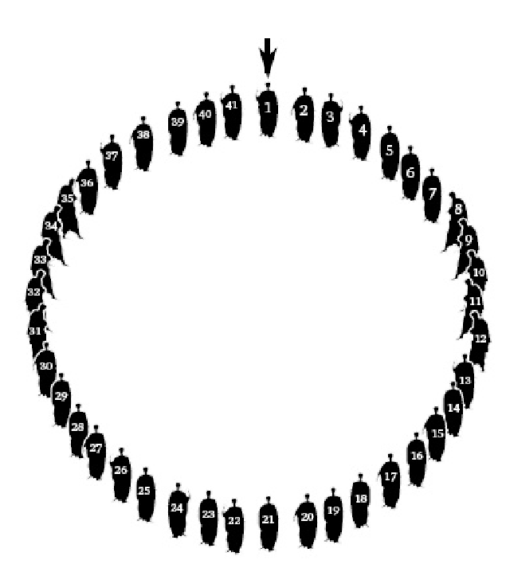
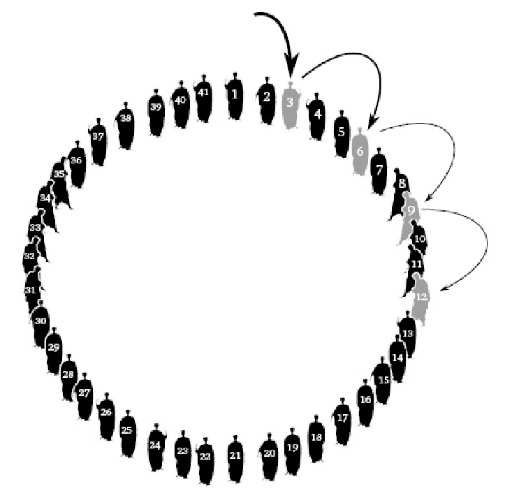
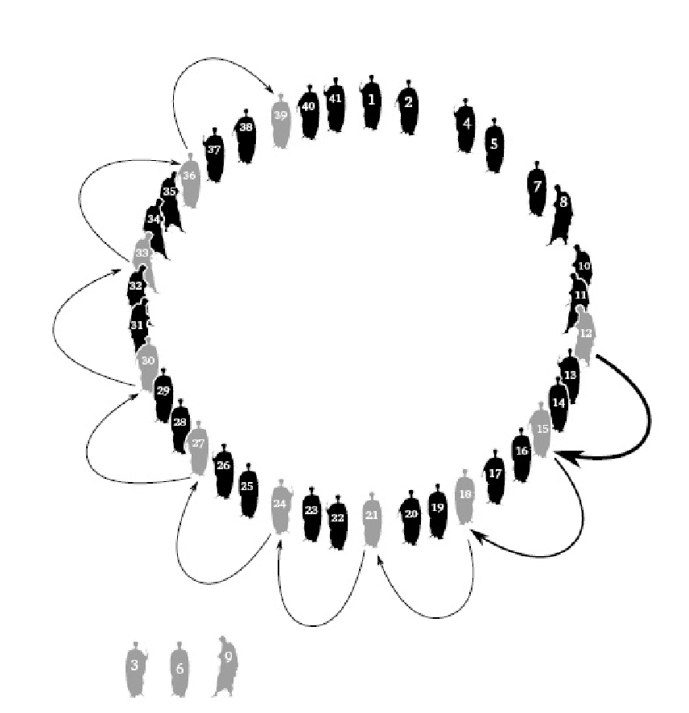
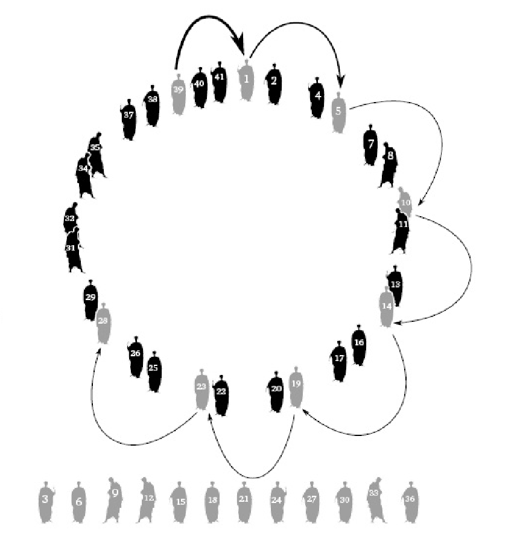
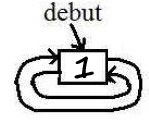
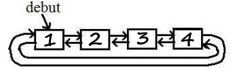

## Objectifs de ce tp

3 notions de C travaillées:
1. des pointeurs
2. des pointeurs
3. encore des pointeurs,

Sans oublier les méthodes et outils de débogage !

**Les ressources de départ pour implémenter ce TP sont disponibles
dans le répertoire `base/TPs/alibaba/` du dépôt git de départ.**

## Thème de l'exercice

Ali Baba se retrouve coincé dans la caverne au trésor avec 40 voleurs.
Tous les voleurs sont prêts à s'entretuer pour s'approprier le trésor.
Ali Baba imagine un stratagème qui lui permettra d'emporter une partie
du trésor sans aucun risque. Plutôt que de s'entretuer, il persuade les
40 voleurs de s'en remettre au hasard pour partager le trésor entre 2
heureux gagnants.

La méthode qu'il propose est la suivante (figures 1 à 4) :

-   41 papiers numérotés de 1 à 41 sont écrits par Ali Baba et choisis
	au hasard par chacune des 41 personnes présentes.
-   Les 41 personnes se placent alors en cercle dans l'ordre des numéros
	tirés.
-   Il est proposé que le chiffre 3 soit l'arbitre du hasard.
-   La 3ème personne de la liste (3) est assommée par son prédécesseur
	dans la liste. Ainsi, même mécontente de son sort, elle n'attentera
	pas à la vie des 2 gagnants finaux.
-   Puis de 3 en 3 en tournant autour du cercle, les perdants ainsi
	désignés sont successivement assommés par leur prédécesseur.
-   Les 2 personnes restantes se partageront le trésor.

Ali Baba, qui avait calculé à l'avance les numéros gagnants, s'était
arrangé pour récupérer les 2 papiers contenant les numéros gagnants. Il
avait proposé en cachette à un des 40 voleurs qui lui semblait le moins
sanguinaire l'attribution d'un numéro gagnant avec la promesse que ce
dernier n'attenterait pas à sa vie à la fin du jeu. A la fin du jeu
proposé, seuls Ali Baba et le voleur qu'il avait choisi restèrent
debout. Ils se partagèrent le trésor et s'enfuirent avant que les 39
perdants ne se réveillent.



<br />



## Exercice

On propose de résoudre le problème d'Ali Baba et des 40 voleurs et de
trouver les 2 numéros de places gagnantes.

### Fonctionnalités attendues

Vous devez écrire un programme qui :

-   crée et affiche la liste initiale des 41 numéros d'Ali Baba et des
	40 voleurs
-   applique la méthode d'Ali Baba pour éliminer petit à petit les
	perdants de la liste initiale, qui seront stockés dans une seconde
	liste;
-   affiche la liste finale des perdants successifs;
-   affiche enfin les deux numéros gagnants.

En option, on pourra tester le programme avec des variantes : autre
nombre de voleurs, autre incrément dans le cercle que le chiffre 3, ou
procéder dans le sens inverse des aiguilles d'une montre pour désigner
les perdants.

### Module de liste doublement chaînée circulaire

Pour résoudre le problème, il est demandé d'utiliser un module de *liste
doublement chaînée circulaire*.




Toutes les fonctionnalités qui vous semblent nécessaires à la résolution
du problème devront être implémentées. A titre d'exemple (liste non
exhaustive et signatures des fonctions à adapter si nécessaire), le
module pourra contenir:
```c
	// insere la valeur n en fin de la liste pointee par pl
	extern void ldc_insere_fin(struct ldc **pl, uint32_t n);

	// affiche le contenu de la liste l
	extern void ldc_affiche(struct ldc *l);

	// retourne le nombre d'elements contenus dans l
	extern uint32_t ldc_taille(struct ldc *l);

	// supprime l'element e de la liste pointee par pl.
	// precondition: *pl non vide, e non null, e dans *pl
	extern void ldc_supprime(struct ldc **pl, struct ldc *e);

	// vide la liste pointee par pl, et libere la memoire.
	// En sortie, *pl == NULL
	extern void ldc_libere(struct ldc **pl);
	...
```
# Difficulté

:star:
